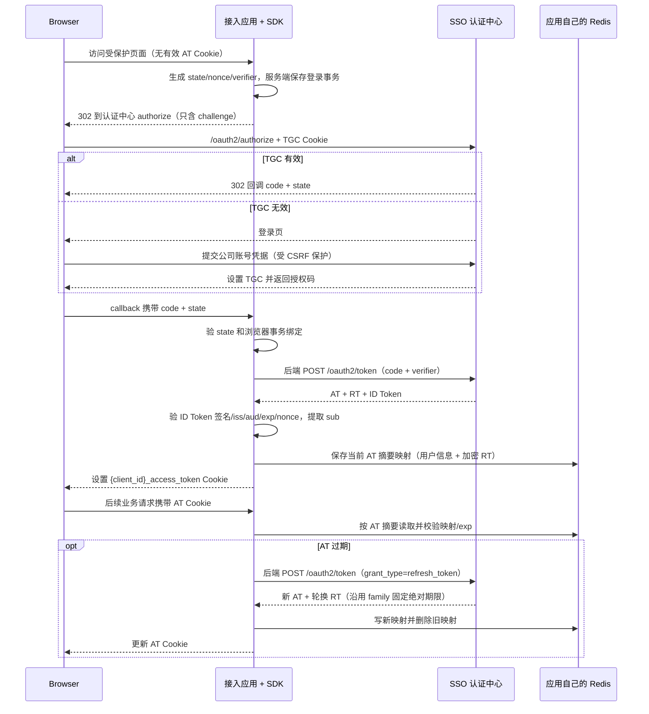

# SSO 应用接入 SDK 架构与开发文档

> 版本：1.0  
> 状态：架构基线；实现与验收进度见 [`SDD 012`](specs/012-sso-client-sdk/spec.md)  
> 目标读者：SDK 开发者、接入应用后端开发者、认证中心维护者  
> 适用技术栈：Java 17、Spring Boot 3.5、Spring Security 6；实现依赖版本应与当前 SSO 工程对齐。  
> 认证中心参考实现：仓库内 `sso-server`、`sso-contracts`、`sso-example-rp`、`sso-resource-example`。

## 1. 目标和范围

开发一个可复用的后端 SDK，让公司旗下的 Spring Boot Web 应用通过少量配置接入当前 SSO 认证中心。SDK 把授权跳转、服务端登录事务、PKCE、callback、令牌交换、ID Token 校验、应用 Access Token Cookie、应用侧 Redis 映射、刷新、撤销和退出封装起来。

SDK 是 OAuth/OIDC **客户端组件**，运行在接入应用后端；它不是新的认证中心，也不替代 `sso-server`。认证中心负责账号认证、TGC、授权码和令牌签发、Refresh Token family 状态、撤销、Discovery/JWKS。应用 SDK 负责与认证中心交互，并维护本应用的登录状态。公司应用无需了解 Spring Authorization Server 的内部实现，只需配置认证中心公开的协议地址和本应用策略。

本文同时定义 SDK 的架构、接口、路由放行、配置、缓存和 Redis 行为、性能要求、故障处理与验收标准。本文是设计文档，不表示 SDK 已经实现。

### 1.1 当前工程现状

- `sso-server` 已使用 Spring Authorization Server 提供 OAuth 2.0/OIDC 协议端点，并实现公司账号认证、TGC、客户端策略、ID Token 签发、Refresh Token rotation/family、撤销和审计。
- 认证中心当前 Access Token 是不透明令牌；RP 不能把它当 JWT 自行解析身份。应用身份应来自经验证的 OIDC ID Token，或来自认证中心 UserInfo/可信资源服务接口。
- `sso-example-rp` 是用于互通演示的 Spring Security OAuth2 Client 示例，目前使用 `oauth2Login` 和 `HttpSessionOAuth2AuthorizedClientRepository`。它展示标准授权码接入，不等同于本文计划中的 `{client_id}_access_token` Cookie + 应用 Redis 映射 SDK。
- `sso-resource-example` 演示资源服务通过内部 Dubbo introspection contract 校验不透明 Access Token。该模式与 RP 登录 SDK 的本地用户映射是不同职责。
- SDK 应复用 Spring Security OAuth2 Client、Nimbus JOSE/JWT 等成熟实现；只实现公司约定的生命周期、存储、Cookie 和自动配置，不重新实现 OAuth/OIDC 密码学协议。

## 2. 设计原则和明确约定

1. 浏览器只参与顶层授权跳转和应用 callback；`code_verifier`、Refresh Token、client secret 均只在服务端。
2. 每次登录由应用 SDK 生成独立的高熵 `state`、`nonce`、`code_verifier`，challenge 固定使用 PKCE `S256`。
3. SDK 通过后端 HTTP 客户端调用认证中心 token endpoint。浏览器不得兑换 code 或刷新 token。
4. ID Token 只用于验证身份和读取必要声明。SDK 必须验证签名、`iss`、`aud`/`azp`、`exp`、`iat`、请求对应的 `nonce`；校验后只保留所需用户信息，随即丢弃 ID Token，不写入 Redis、数据库、Cookie 或日志。
5. 应用浏览器 Cookie 名按客户端区分，默认 `{client_id}_access_token`，值为认证中心签发的 Access Token。Cookie 必须为 `Secure`、`HttpOnly`，适当设置 `SameSite`、Path 和 Domain。
6. Access Token 的逻辑有效期是硬边界。过期 token 只能用于查应用 Redis 中的刷新上下文并触发刷新，绝不能用于访问业务资源。
7. 应用 Redis 对当前 Access Token 只保留一条映射记录：用户必要信息、Access Token `exp`、加密保存的当前 Refresh Token、Refresh Token 固定绝对过期时间及会话元数据。Refresh Token 绝对期限不因轮换而延长。
8. Refresh Token 成功轮换后，应用写入新 Access Token 映射、更新浏览器 Cookie，再删除旧映射。Refresh Token 过期、撤销、重放或刷新失败时清除 Cookie/映射并重新走 SSO。
9. Redis 记录有固定兜底 TTL：Refresh Token 初始绝对到期时间加有限清理宽限期。发现 Refresh Token 已过期就立即删除，不等待宽限期；Cookie 被用户清除而无后续请求时，TTL 负责最终回收。
10. 单应用退出只退出当前 RP；全局退出调用认证中心撤销当前用户 TGC 和相关 refresh families。两种语义必须在应用 UI 中区分。

## 3. 系统边界和交互



认证中心 Cookie `TGC` 只发给认证中心域名，用于 SSO 会话；应用 Access Token Cookie 只发给该应用域名，用于应用登录态。两种 Cookie 不可混用，SDK 不能读取或复制 TGC。

## 4. 当前认证中心接口契约

SDK 启动时以固定配置的 `issuer-uri` 获取 OIDC Discovery 文档，使用发现的 endpoint 和 `jwks_uri`；不能从未经验证的 token claim 动态选择 issuer 或 JWKS 地址。

当前 server README 声明的主要端点如下；最终路径以 Discovery 元数据和实际服务配置为准：

| 认证中心端点 | SDK 用法 | 认证中心职责 |
|---|---|---|
| `GET /.well-known/openid-configuration` | 首次启动/缓存刷新，发现 issuer、authorize、token、jwks、userinfo、revocation 等地址 | 发布 OIDC 元数据 |
| `GET /oauth2/jwks` | 下载/刷新可信公钥，验证 ID Token 签名 | 发布签名公钥 |
| `GET /oauth2/authorize` | 浏览器顶层跳转；携带 `client_id`、精确 `redirect_uri`、`scope`、`state`、`nonce`、S256 challenge | 校验授权请求和 TGC，签发 code 或要求登录 |
| `POST /oauth2/token` | SDK 后端兑换 code；或以 `grant_type=refresh_token` 刷新 | 校验 code/PKCE/client 或 Refresh Token family，签发/轮换令牌 |
| `POST /oauth2/revoke` | 当前 RP 退出时撤销 refresh token（必要时 access token） | 撤销 token/family，响应遵循幂等语义 |
| `GET/POST /userinfo` | 仅当所需属性未由 ID Token scope claims 提供且 client 有相应 scope 时使用 | 校验不透明 Bearer AT，返回 scope 允许的用户声明 |
| `GET /login`、`POST /login/submit` | 由浏览器跟随认证中心重定向；SDK 不提交账号密码 | 认证中心显示登录、校验公司账号、建立 TGC |
| `POST /logout` | 仅全局退出流程使用，需通过浏览器发起且符合 CSRF 策略 | 撤销 TGC 和关联 refresh families |

认证中心另有供公司资源服务使用的 Dubbo `TokenIntrospectionService`，它不是浏览器端点，也不是普通 RP 登录时每次请求都要调用的接口。SDK 通过本地 Redis 映射完成应用自己的用户识别；独立资源服务器可以使用 introspection/Dubbo contract 验证 opaque Access Token。

客户端必须登记唯一、精确的 callback URI；当前 server 要求 `openid`、非空 `state`、`nonce` 和 PKCE S256。生产 client 使用登记的 confidential client 认证方式（当前示例为 `client_secret_basic`），client secret 由 secret manager 注入，不进代码仓库或浏览器。

## 5. SDK 模块架构

建议拆分为以下 Maven 模块；若先以单模块交付，也应保留这些包边界：

```text
sso-client-core
  config/          属性对象、校验、默认值、自动配置条件
  protocol/        Discovery、authorize URL、token/revoke HTTP client
  security/        PKCE、state、nonce、ID Token 校验、浏览器事务绑定
  web/             Filter、登录/callback/logout/status endpoints
  session/         当前用户、Spring Security Authentication 映射
  token/           AT 逻辑过期、刷新 single-flight、family 生命周期
  store/           TokenStore、TransactionStore、本地实现、Redis 实现
  cookie/          AT Cookie 写入/清除、属性校验
  observability/   脱敏日志、metrics、trace

sso-client-spring-boot-starter
  自动引入 core 和 Spring Boot auto-configuration
```

starter 必须是可选依赖：应用引入后自动装配；没有 `sso.client.enabled=true` 时不改变现有 SecurityFilterChain。自动配置遵循 `@ConditionalOnMissingBean`，让应用可以替换 UserMapper、TokenStore、HTTP client、cookie writer 等接口。SDK 不接入认证中心的数据库，不依赖 `sso-contracts` 内部 RPC，不复制 server-side authorization 逻辑。

### 5.1 请求处理顺序

1. `SsoAuthenticationFilter` 只匹配配置的受保护路径。
2. 读 `{client_id}_access_token` Cookie；没有 token 则保存安全的站内 return path 并触发 `/sso/login` 流程。
3. 对 Cookie AT 求 HMAC/SHA-256 lookup key，从应用 TokenStore 读取唯一当前映射。
4. 缺映射、逻辑过期、映射 client/issuer 不匹配或 Refresh Token 已到固定期限：清理本地状态并重启 SSO。逻辑过期的 AT 不能传给下游当作已认证 token。
5. 未过期时，在 `SecurityContext` 建立 SDK 的 `SsoAuthentication`/`SsoPrincipal`，必要时把 opaque AT 转发给下游服务；不在每个请求上同步调用认证中心。

如果项目希望 refresh-on-demand，AT 到期时可先尝试 refresh 再继续当前请求；若配置为 `refresh-before-expiry`，在安全阈值内提前刷新。默认建议到期时 refresh，避免后台请求为每次快到期都产生刷新；对高并发 web app 可设提前量并通过 single-flight 合并。

## 6. SDK 对接应用暴露的接口

### 6.1 SDK 提供的 HTTP 路由

| 路由 | 方法 | 是否匿名可达 | 行为 |
|---|---|---|---|
| `/sso/login` | GET | 是 | 创建一次性服务端登录事务；只允许站内相对 `returnTo`；302 跳转至 Discovery 的 authorization endpoint |
| `/sso/callback` | GET | 是（必须有合法事务） | 读取 `code/state` 或标准 OAuth error；校验 state、浏览器绑定、事务 TTL；后端兑换 code；验证 ID Token；存 TokenStore；设置 AT Cookie；302 到已存安全 return path |
| `/sso/logout` | POST | 可达但必须验证 CSRF | 退出当前 RP：尝试向认证中心 revoke 当前 RT，删除本地映射并清 AT Cookie；绝不把 GET 作为有副作用 logout |
| `/sso/status` | GET | 默认需已认证，可配置关闭 | 返回 `authenticated`、subject 和 AT 到期时间等非敏感状态；不返回 AT/RT/ID Token |
| `/sso/back-channel-logout` | POST | 仅当 server 配置并启用已登记协议时匿名路由 | 可选扩展：验签/校验 logout token、issuer/audience/事件、jti 和 sid，幂等清理会话；初版可不开放 |

应用自己的登录页、静态资源、错误页和业务接口由应用控制。SDK 不增加 `/login` 账号密码页面；登录凭证只提交给认证中心。SDK 的 callback 只接受认证中心标准 redirect 响应，禁止开放重定向。

### 6.2 SDK Java API

建议提供稳定且少量的公共类型：

```java
public interface SsoPrincipalMapper {
    SsoPrincipal map(VerifiedIdTokenClaims claims);
}

public interface SsoTokenStore {
    Optional<SsoTokenRecord> findByAccessToken(String accessToken);
    void saveCurrent(String oldAccessToken, SsoTokenRecord newRecord);
    void deleteByAccessToken(String accessToken);
    Optional<SsoTokenRecord> removeCurrentBySubjectAndClient(String subject, String clientId); // 原子取出并移除当前映射，logout 必需
}

public interface SsoAuthorizationRequestStore {
    void save(String state, SsoAuthorizationTransaction transaction, Duration ttl);
    Optional<SsoAuthorizationTransaction> consume(String state);
}

public interface SsoLogoutHandler {
    LogoutResult logoutCurrentApplication(String accessToken, SsoTokenRecord record);
}
```

`findByAccessToken` 实际必须用配置密钥对 token 求 HMAC 后查询，不得用原始 bearer token 作为 Redis key。`saveCurrent` 语义应是写入新映射成功后再删除 old token 映射；实现应提供原子 Lua/事务操作，或清楚报告存储状态。`consume` 必须原子单次消费 state，阻止 callback 重放。

SDK 可发布：`SsoPrincipal`、`SsoAuthentication`、`SsoCurrentUser`、`SsoLoginService`、`SsoLogoutService`、`SsoTokenStore`、`SsoPrincipalMapper`、`SsoAuthorizationRequestStore`。不要将 Spring Security 内部类或 Nimbus 实现对象作为长期公共 API。

### 6.3 扩展点责任

| 扩展接口/Bean | 应用替换场景 | 安全约束 |
|---|---|---|
| `SsoPrincipalMapper` | 不同应用的 `sub` 到内部用户实体映射；只映射所需 claims | 入参只能是 SDK 已验证 claims；不可重新信任未验 JWT |
| `SsoTokenStore` | 公司自有 Redis、数据库或加密 KV | 存 RT 密文；键为 AT HMAC；固定 family 到期；原子替换旧/新映射 |
| `SsoAuthorizationRequestStore` | 分布式 Redis、数据库，或单机本地模式 | state 一次性；transaction TTL；verifier 不得出服务端/写日志 |
| `SsoCookieCustomizer` | 特定域名、path、SameSite 策略 | 不允许关闭 Secure/HttpOnly 的生产策略，不允许把 RT/ID Token 写 Cookie |
| `SsoHttpClientCustomizer` | 代理、企业 TLS、连接池、DNS、指标 | issuer/JWKS URL 必须受信任配置；禁任意重定向和 SSRF |
| `SsoLogoutListener` | 应用登出后的清理、审计或业务事件 | listener 失败不能复活已删除会话；不接触明文 token 日志 |
| `SsoFailureHandler` | 应用自己的错误页/JSON 返回 | 不泄露 OAuth 内部错误、code、token 或用户是否存在 |

初版不要提供任意 TokenValidator 覆盖默认严格校验的接口。若后续要支持企业多 issuer，应增加明确的 issuer registry 和每 issuer client 配置，不接受 token 自带地址。

## 7. 路由保护与放行策略

SDK 不能把整个应用 SecurityFilterChain 替换掉。它提供 matcher/filter 或 Spring Security configurer，由应用把它合并进自己的安全配置。路径规则在启动时编译、校验；匹配优先级固定为：SDK 必要 callback/login → 应用显式公开路径 → 受保护路径 → 应用原有安全规则。公开路径不得覆盖 callback 的协议校验。

### 7.1 默认路由清单

| 路由类别 | 默认决策 | 原因/处理 |
|---|---|---|
| `/sso/login` | 放行匿名访问 | 必须创建服务端 transaction 后再重定向，不直接信任 `returnTo` |
| `/sso/callback` | Spring Security 层放行匿名请求；SDK callback handler 必须验 state/code | 浏览器尚无应用登录态，依赖一次性事务校验 |
| `/sso/logout` | 仅 POST handler 开放；CSRF 必须启用 | 销毁/撤销动作不得通过 GET 触发 |
| `/sso/status` | 默认受保护；不需要时可禁用 | 避免暴露会话探测接口 |
| 业务路径，如 `/api/**` | 默认受保护；可按应用配置 matcher | SDK 验证 AT、装载 principal，未登录时 401 或跳转由响应模式决定 |
| 静态资源、favicon、应用 landing page | 不由 SDK 猜测；由应用显式配置 permit list | 各应用路由不同，安全配置应显式、可审计 |
| `/actuator/health`、metrics、管理 API | 不由 SDK 自动公开；由应用网络/安全策略控制 | 避免 starter 意外开放运维端点 |
| 认证中心 `/login`、`/oauth2/*`、`/userinfo` | 不属于 RP 的 SDK 路由 | 这些是认证中心地址，不在业务应用上新增同名 controller |

默认建议受保护路径为 `/**`，但必须允许应用明确列出公开资源；若 starter 检测不到应用 SecurityFilterChain，可采用 SDK 默认链保护所有路径并只放行自身 login/callback 和显式公开项。启动日志应打印最终 matcher（不含 secrets），并对重复/冲突配置 fail fast。

### 7.2 错误响应模式

配置 `sso.client.response-mode=redirect|status`：

- 浏览器页面请求缺登录态时 redirect 到 `/sso/login`；callback 出错显示通用错误页面。
- API/AJAX 请求不应 302 到 HTML 登录页，默认返回 `401` JSON `{ "error": "authentication_required" }`，可附 `WWW-Authenticate`；前端可以再打开 SSO 登录页面。
- Access Token 已过期时先按策略刷新；刷新失败则清会话，页面请求重新 SSO，API 请求返回 401。
- 认证中心短时不可用时不得绕过身份验证；页面返回可重试错误，API 返回 503，带 request ID，不带上游响应敏感内容。

## 8. 登录、令牌和退出的实现逻辑

### 8.1 发起登录

1. 验证原始请求目标是当前应用允许的站内相对 path；拒绝绝对 URL、协议相对 URL、反斜杠、控制字符和编码绕过。
2. 生成密码学安全随机 `state`、`nonce`、`code_verifier`；`code_challenge = BASE64URL(SHA256(verifier))`，不带 padding。
3. 用 server-side AuthorizationRequestStore 保存 `state` 摘要、nonce、verifier、client ID、redirect URI、创建时间、return path、scope 和浏览器绑定值，TTL 默认 5–10 分钟。state 必须一次消费。
4. 为浏览器设置短时、不含协议秘密的 pre-auth correlation cookie 或使用同等强度的服务端会话绑定，callback 时校验浏览器与 transaction 绑定，抵御 login CSRF。
5. 返回 302 至 Discovery 提供的 authorize endpoint，含 `response_type=code`、`client_id`、已登记 redirect URI、scope、state、nonce、challenge 和 `code_challenge_method=S256`。Verifier 绝不进入 URL、HTML、浏览器存储或日志。

### 8.2 Callback 和 ID Token 验证

1. callback 无匿名 transaction、state 不匹配/已消费/过期、浏览器绑定不符、OAuth error 或缺 code 时，拒绝并清理 transaction。
2. 后端向固定 issuer 的 token endpoint 发 POST，使用 `authorization_code`、code、原 redirect URI、verifier 和登记的 client authentication。code exchange 不自动重试：code 是一次性凭证，网络超时后状态可能不确定；要求用户重新开始授权。
3. 处理 token response 时要求 `token_type=Bearer`，校验必要字段和类型、`expires_in` 为 1–86400 秒整数、scope 与 token 字段长度/响应体大小上限。ID Token 使用 Discovery issuer/JWKS 验签，固定允许算法；校验 `iss` 精确匹配、`aud` 含当前 client ID、多 audience 时验证 `azp`、`exp`、`iat`、可选 `nbf`、事务 nonce 完全匹配，以及 `sub` 非空。设置有限 clock skew，默认 60 秒以内。
4. 对 JWKS `kid` 未命中，最多触发一次受限刷新后再验；不接受 `alg=none`、token header 的任意 `jku`/`x5u` 或动态 issuer。
5. 把已验证的 `iss + sub` 作为身份键，交给 SsoPrincipalMapper 生成最小 `SsoPrincipal`。显示名/email 只在 scope 已批准且 claim 合法时纳入。立即丢弃 ID Token 原文和完整 claims。
6. 保存 AT 映射：key 为 HMAC(access token)，值为用户必要信息、AT `exp`、RT 加密密文、fixed `refresh_family_exp`、client、issuer、有效 granted scopes、nonce 摘要、认证时间和版本。Refresh 使用记录内的 scope 上限；若 refresh response 省略 scope，沿用该记录，不恢复到配置中更宽的请求范围。先持久化成功，再返回 Set-Cookie。若本地存储失败，不能发出看似成功的登录 Cookie；清理/撤销 token 或提示重试/重新认证。
7. 清理 state transaction 和 pre-auth cookie；302 回安全的站内 return path，callback URL 不带 code/state。

### 8.3 Refresh Token 刷新

1. `SsoAuthenticationFilter` 发现 AT 到 `exp` 或落入提前刷新窗口时，对当前 AT 摘要做单实例锁 + Redis 分布式锁/single-flight；锁必须有短 lease、owner token、超时和释放保护。
2. 所有会话查找（包括仍未过期的 AT 和 rotation overlap）都先检查固定 `refresh_family_exp`。已到期则立即删除映射、清 AT Cookie，交给登录流程重走 SSO；Redis 的 cleanup grace 仅用于回收，不延长认证权限。
3. 以 RT 原文、client 身份向 token endpoint 请求 `grant_type=refresh_token`。只允许一个并发刷新。不要盲目自动重试：认证中心可能已消费旧 RT 并返回新 RT，只是响应丢失；重放可能按 server family policy 撤销整个 family。
   在发出请求前，先基于旧 RT 的 HMAC 指纹原子写入一次性 refresh-attempt 标记，TTL 保留至 `refresh_family_exp + cleanup_grace`。Redis 中只保存该指纹的再次 HMAC，不保存 RT 原文。标记写入结果不确定或标记已存在时，本次必须 fail closed，删除旧映射且不发送旧 RT。Redis 模式下标记独立于 AT 映射，进程崩溃/重启后仍能阻止旧 RT 重放；本地开发存储的标记仅在当前进程有效。
4. 成功响应中的新 RT 沿用认证中心 family 初次签发时的绝对 expiry，SDK 不得根据新的 `expires_in` 擅自延长 family；新的 AT 有自己的短 `exp`。
5. 验证刷新响应的 ID Token（如果 response 包含），其 `iss`、`aud`、签名/时间等需满足 OIDC 规则，`sub` 必须与当前已验证 principal 一致；刷新 response 若带 `nonce`，必须与初次登录 nonce 一致。TokenStore 只保留登录 nonce 的 SHA-256 摘要用于此比较。刷新响应无 ID Token 时沿用已验证 principal，不虚构或持久化 ID Token。
6. 原子写新映射，设置 TTL 至 `refresh_family_exp + cleanup_grace`；Set-Cookie 新 AT 后删除旧 AT key。若失败，拒绝当前业务请求。
   旧 AT 到新会话的加密 overlap 映射保留 10 秒，长于 8 秒的刷新锁等待上限，让等待中的并发请求可以读取刚完成的轮换结果。只有当前 AT 仍超过 refresh skew 且 family 未过期时，overlap 才能返回会话。
7. `invalid_grant`、family 已过期/撤销/重用时删除映射和 cookie，并触发新 SSO。Redis 不可用时 fail closed；不得改用本机缓存绕过 Redis 校验。

**刷新响应丢失/存储失败的设计限制**：如果认证中心已经轮换并消费旧 RT，但 SDK 未能保存新 RT，旧 token 不能安全地继续使用。初版按失败关闭：删除本地登录状态，重新走授权码流程；浏览器仍有有效 TGC 时通常可免交互登录。不要为了“自动恢复”无限重试旧 Refresh Token。

### 8.4 单应用退出和全局退出

- RP `POST /sso/logout`：CSRF 校验；从 TokenStore 取当前 RT；调用认证中心 `/oauth2/revoke`；无论上游暂时不可达，都清除应用侧 cookie/映射并结束本地会话，记录远程撤销是否确认。因为 AT 不透明，退出是否即时使 AT 对资源 API 失效取决于认证中心/revocation/introspection。退出响应绝不保留 RT。
- 全局退出：在可信浏览器请求中跳转/POST 至认证中心全局 logout，由认证中心撤销 TGC 和该 subject 的 refresh families。RP 的 `{client_id}_access_token` 需由 logout return/back-channel 通知或下次遇到无效 AT 时清理。SDK 不可尝试删除认证中心域名 TGC Cookie。
- 认证中心当前 SDD 将 per-client logout UX 标记为 out of scope；SDK 首版只实现 RP 本地退出 + token revoke，不承诺全局退出的实时跨应用通知。

## 9. 配置设计

前缀统一为 `sso.client`。属性支持 YAML/env override；secret 不允许以普通配置文件明文提交。未知属性保留警告或 fail-fast 策略，不能静默拼错关键值。

### 9.1 核心配置

| 属性 | 默认/规则 | 说明 |
|---|---|---|
| `enabled` | `false` | 设 true 才启用 SDK 自动配置，避免依赖 starter 后破坏应用原安全配置 |
| `issuer-uri` | 必填 | 固定 HTTPS issuer；本机开发可允许 localhost HTTP |
| `client-id` | 必填 | 与认证中心注册完全匹配 |
| `client-secret` | 外部 secret 必填（confidential client） | 推荐环境变量/secret manager；不得打印 |
| `client-authentication-method` | `client_secret_basic` | 需与 client registry 一致；后续可扩 private_key_jwt/mTLS |
| `redirect-uri` | `{baseUrl}/sso/callback` | 必须在认证中心精确登记；反向代理场景只信任配置的 forwarded headers |
| `scope` | `[openid, profile]` | 最小化申请；`email`/业务 scope 按审批配置 |
| `login-path` | `/sso/login` | SDK 起始登录入口 |
| `callback-path` | `/sso/callback` | 必须与 redirect URI path 对应 |
| `logout-path` | `/sso/logout` | POST only，受 CSRF 保护 |
| `status-enabled` | `false` | 是否开放 SDK session status 路由 |
| `protected-paths` | `/**` | 需要 SSO 的 Ant/PathPattern matcher，启动校验 |
| `public-paths` | 空，SDK 自有 login/callback 除外 | 应用显式 permit list；health/actuator 不自动放行 |
| `response-mode` | `auto` | 页面缺认证 redirect；API 缺认证 401 |
| `return-to-parameter` | `returnTo` | 值只允许安全站内相对路径 |
| `token-cookie.name` | `${client-id}_access_token` | cookie 名必须符合 RFC token 字符集和浏览器限制 |
| `token-cookie.secure` | `true` | 生产不允许 false |
| `token-cookie.http-only` | `true`，不可关闭生产安全默认 | 防止脚本读取 AT |
| `token-cookie.same-site` | `Lax` | 只有经评审的跨站流程可改 `None`，此时必须 Secure 并加强 CSRF |
| `token-cookie.path` | `/` | 不设置宽泛 Domain；host-only cookie |
| `token-cookie.max-age-mode` | `refresh-family-expiry` | 让过期 AT 暂时能被送到后端找到刷新记录；到 RT family 固定过期时失效 |
| `token.cookie-cleanup-grace` | `5m` | Cookie/Redis fallback 的有限清理余量，不增加 RT 有效期 |
| `sso.client.family-lifetime` | `30d` | 必须与认证中心 `sso.refresh-token-ttl-seconds` 一致；认证中心默认值为 2592000 秒 |
| `token.refresh-skew` | `30s` | 可配置提前刷新窗口；`0` 表示恰好过期才刷新 |
| `token.refresh-lock-lease` | 自动计算 | refresh lease 覆盖 discovery 与 token 请求的连接/响应超时，并加 5 秒余量 |
| `token.max-response-size` | `32KiB` | 限制 token/discovery 响应大小 |
| `token.clock-skew` | `60s` | ID Token 时间校验容差上限建议不超过 2 分钟 |
| `token.refresh-retry` | `0` | 默认禁止 token/refresh 自动重试 |

### 9.2 缓存、Redis 与本机 fallback 配置

| 属性 | 推荐默认 | 语义 |
|---|---|---|
| `store.mode` | `auto` | `redis`、`local` 或 `auto` |
| `store.redis.enabled` | 根据 Redis starter/连接配置推断 | Redis 是多实例应用生产默认存储 |
| `store.redis.key-prefix` | `sso:rp:{client-id}:` | 环境、应用、client 隔离；不得跨 client 共用 keyspace |
| `store.redis.timeout` | `500ms`–`1s` | 应按部署网络配置；超时 fail closed |
| `store.redis.tls` | 生产 true | TLS/ACL/最小权限由应用基础设施提供 |
| `store.local.max-size` | `10_000` | Caffeine 有界容量，防止无上限内存增长 |
| `store.local.allow-in-prod` | `false` | 生产多副本禁止无意回退本地状态 |
| `store.transaction-ttl` | `10m` | state/nonce/verifier server-side transaction 短 TTL |
| `store.mapping-cleanup-grace` | `5m` | token map 的 RT family expiry 后兜底 TTL |
| `cache.discovery-ttl` | `10m` | Discovery metadata 内存缓存 |
| `cache.jwks-refresh-interval` | `5m` | 正常刷新公钥；`kid` miss 可单次强制刷新 |
| `cache.jwks-stale-if-error` | `1h` | issuer 固定且 key 已缓存时短暂用旧 JWKS；超过期限 fail closed |
| `sso.client.user-mapping-cache-ttl` | `0` | Caffeine L1 token mapping cache；`0` 关闭，最大 `1s`。启用后同一实例本地命中可在短暂 Redis 故障时继续使用，跨实例撤销最多延迟 TTL；严格即时撤销时保持 `0` |

`auto` 的规则：未配置 Redis 且运行于明确的单机开发/test profile 时，可使用有界本机缓存；配置 Redis 后使用 Redis。**不能在 Redis 运行时故障时悄悄降级为本机缓存**，否则多副本状态分裂、Refresh Token 并发控制失效、旧 token 可能被误接受。生产 profile 缺少共享 TokenStore/AuthorizationRequestStore 时启动失败，除非运维显式打开高风险 `allow-in-prod` 并且部署副本数为 1；启动日志和健康状态必须明确显示 local mode。

可使用本机缓存的内容：Discovery/JWKS 元数据（有 TTL、stale 上限及 key rotation 处理）、短时单机开发 state transaction、开发单实例 token map。不可用本机缓存替代：生产多实例 Refresh Token 状态、logout/revocation 状态、一次性 state/refresh lock、跨实例 AT→principal 映射。

### 9.3 最小配置示例

```yaml
sso:
  client:
    enabled: true
    issuer-uri: ${SSO_ISSUER:https://sso.example.com}
    client-id: orders-web
    client-secret: ${SSO_CLIENT_SECRET}
    client-authentication-method: client_secret_basic
    redirect-uri: https://orders.example.com/sso/callback
    scope: [openid, profile, resource.read]
    protected-paths: [/api/**, /account/**]
    public-paths: [/, /assets/**, /actuator/health]
    login-path: /sso/login
    callback-path: /sso/callback
    logout-path: /sso/logout
    store:
      mode: redis
      redis:
        key-prefix: sso:rp:orders-web:
        timeout: 750ms
        tls: true
    token:
      cookie:
        secure: true
        http-only: true
        same-site: Lax
        path: /
      refresh-skew: 30s
```

此配置不能覆盖认证中心 client registry；实际 `client_id`、secret、scope、callback URI、grant types、刷新期限和 revoke 权限必须先在认证中心 provision。

### SDK implementation note: discovery and JWKS

The implemented starter fetches discovery metadata only from the configured issuer and rejects endpoint metadata that changes the issuer origin. Discovery metadata is cached for a bounded configurable interval; discovery and token/revoke responses are capped at 32 KiB. Authorization requests use Spring Security's `OAuth2AuthorizationRequest` builder and `OAuth2AuthorizationRequestCustomizers.withPkce()`; authorization-code and refresh exchanges use `RestClientAuthorizationCodeTokenResponseClient` and `RestClientRefreshTokenTokenResponseClient`, with the SDK's bounded `RestClient`, OAuth2 response converter and extra response/scope validation. RFC 7009 revocation remains a bounded form POST because Spring Security OAuth2 Client has no revocation response client. JWKS uses a separate bounded cache (default refresh interval 5 minutes, default stale-if-error window 1 hour); the response is limited to 1 MiB and at most 100 unique-key-ID public RSA signing keys of at least 2048 bits. ID-token verification accepts RS256 only. An unknown `kid` can trigger a refresh, rate-limited to one attempt per 5 seconds. A previously trusted key is usable during the configured stale window when refresh fails; after that, validation fails closed. The starter health indicator checks discovery, JWKS and the configured token store.
## 10. 缓存和性能优化

### 10.1 请求热路径

- 每个受保护请求只读一次应用 TokenStore，以 `HMAC(access_token)` 查记录；避免每个业务请求同步访问 SSO token endpoint 或 UserInfo endpoint。
- Redis token mapping 可选由 Caffeine 提供有界 L1 cache（最多 100,000 条，TTL 配置范围 `0..1s`，默认 `0` 关闭）。实例内成功写入/删除会清理缓存；其他实例的撤销最多在 TTL 后可见。启用期间，本机命中可在 Redis 暂时不可用时继续认证，cache miss 仍 fail closed；要求实时撤销或 Redis 故障时一律拒绝时保持 TTL 为 `0`。Family expiry 仍在每次 session resolve 时校验，缓存不能延长 family 生命周期。
- Redis value 存 compact JSON/CBOR principal；限制 claim 数量/大小，只保留 `iss`、`sub`、授权 scope 和应用确需属性。
- RT 密文使用 envelope encryption 或 AEAD（如 AES-GCM），密钥由 secret manager 提供；nonce/associated data 绑定 `client_id`、access digest、family expiry。只使用 Redis TLS 不等同于静态数据加密。
- Discovery/JWKS 用有界内存缓存和并发刷新合并；正常请求不每次拉网络。定时刷新失败可在配置 stale window 内使用此前可信 key；未知 `kid` 触发单次限速刷新，仍无 key 则拒绝 token。

### 10.2 Token endpoint HTTP 性能

- 使用单例连接池 HTTP client，配置 connect/read/response timeout、TLS 校验、最大连接数、idle connection eviction、响应体大小和 DNS 策略。
- Discovery/JWKS GET 可有限指数退避；code exchange、Refresh Token rotation 和 revoke POST 不做通用自动重试。
- 连接认证中心失败时，业务身份验证 fail closed；API 返回 503/401 的区别按失败类别定义，不能把上游不可用伪装成 token 无效或匿名成功。
- 每 client/issuer 配置连接池与 rate limiter，避免 refresh storm；refresh-skew 使用随机 jitter（如 ±10%）分散同一批 token 的刷新峰值。
- callback、refresh、revoke 请求都带 request correlation ID；禁止带 state/code/token 作为 log/metric label。

### 10.3 刷新并发和存储写路径

- 同一旧 AT/RT family 的并发请求合并成一次刷新（single-flight）。多 JVM 使用 Redis 分布式锁或原子 compare-and-set；锁中不放 token 原文，锁 key 用 digest。
- Redis 新映射写入、旧映射删除尽可能用 Lua script/事务保障原子性；先保留到新记录成功落库后再删旧记录。
- Refresh Token 轮换成功但应用写 Redis 失败时，不能再用旧 RT；按 8.3 的失败恢复策略重新 SSO。这个窗口应有错误指标和告警。
- Redis pipeline 可用于批量清理用户/应用映射，但不能将 code/state 一次性消费或 RT rotation 拆成非原子操作。

## 11. 安全、隐私与审计

- Cookie：`Secure; HttpOnly; SameSite=Lax`，host-only，Path 最小化；不得在 URL、前端 JS、LocalStorage、sessionStorage 放 Refresh Token/ID Token/client secret/verifier。
- CSRF：应用保留 Spring Security CSRF；所有有副作用的应用 endpoint 用 POST；校验 CSRF token 和 Origin/Fetch Metadata。`SameSite` 仅作为纵深防护，不能单独代替 CSRF。
- 登录事务：state/nonce/verifier 高熵、单次使用、短 TTL、服务端保存；state 与浏览器 transaction cookie/session 绑定。returnTo 只能站内相对路径。
- ID Token：issuer 固定配置 + Discovery metadata/JWKS、严格算法白名单、signature/iss/aud/azp/exp/iat/nonce/sub 检查；unknown `kid` 防止刷新风暴。
- Refresh Token：应用侧只存加密密文，认证中心端执行 rotation/family expiry/replay detection。应用侧固定 family absolute expiry，refresh 不能续长此 expiry。
- Opaque Access Token：不 decode、不猜用户；根据应用自己的有效映射或调用可信资源服务校验。绝不因“Redis 有用户记录”绕过 AT `exp`。
- 日志禁止保存密码、Cookie、authorization code、AT、RT、ID Token、client secret、verifier、原始 state。可记录 client ID、内部 request ID、错误类别、匿名化 subject digest、耗时和 outcome。
- Actuator/metrics 不包含 token value、Redis key 原文、PII 或 client secret；health detail 只对内网开放。
- 错误提示不能区分“用户不存在”和“密码错误”；callback 向浏览器返回通用错误及 request ID。

## 12. 故障和降级策略

| 故障 | SDK 行为 |
|---|---|
| Discovery 首次不可用 | starter readiness 不通过/拒绝开始 SSO；不从未配置 URL 猜 endpoints |
| JWKS 暂时不可用但已有可信缓存 | stale window 内可以用缓存 key 验签；超过 stale 上限 fail closed |
| Redis 不可用 | 生产 fail closed，服务 readiness 标记降级；不切换到 local store |
| 本机缓存满 | 有界 eviction；transaction 不可安全保存则返回 503/重新登录，不能覆盖活跃 state |
| Token exchange 超时 | 不自动重放 authorization code；清理待办 transaction，用户重新开始登录 |
| Refresh 请求超时 | 不盲目重试旧 RT；检查本地状态无法确认时清会话并重新 SSO |
| 认证中心返回 `invalid_grant` | 删除本地 mapping/Cookie，重走 SSO；记录脱敏事件 |
| Cookie 被浏览器清除 | 下一请求没有 AT，SDK 新起授权；孤儿 Redis mapping 靠固定 absolute TTL + grace 回收 |
| 认证中心撤销/全局退出 | refresh/revoke 或可信 logout notice 后清本地；若没有 back-channel，opaque AT 失效延迟受 server/resource 校验方式影响 |
| 应用 Redis 写入失败（token 已轮换） | 不发新 AT Cookie；旧 RT 不再使用；fail closed、清状态、重新授权并告警 |

## 13. 运维观测

SDK 可提供 Micrometer 指标：`sso.client.login.started/succeeded/failed`、callback outcome、ID Token validation failures（按错误类别）、token endpoint latency/status、refresh attempted/succeeded/invalid_grant/replay、Redis lookup/write latency、active local mode、cookie issuance/clear、single-flight waiters、JWKS refresh。

指标标签仅使用有限基数值（client registration ID、endpoint、outcome、status family），不得加入 user ID、token、state、email 或任意 redirect URL。日志统一带 correlation ID；应用 health 可报告 issuer discovery age、store connectivity 和 key cache age，不返回密钥/凭证。

## 14. 开发里程碑

1. **协议契约锁定**：以当前认证中心 Discovery、client registry、token response、revoke 行为为基线；整理实际 scopes、claim、TTL、client auth、opaque AT 验证方式。
2. **SDK Core**：typed configuration、Discovery/JWKS、PKCE、state transaction、token exchange、ID Token validator、cookie utility。
3. **Spring Boot Starter**：自动配置、filter/route、principal mapper、错误处理、application route matchers。
4. **持久化**：本机开发 TokenStore/TransactionStore；Redis 生产实现（原子 consume/replace、AEAD RT、绝对 TTL、client namespace）。
5. **生命周期**：refresh single-flight、固定期限、revoke、单应用退出、back-channel 扩展接口但默认关闭。
6. **示例迁移**：保留现有 `sso-example-rp` 作为标准 OAuth client 互通样例；另建 SDK 示例 profile，展示一份 YAML 和当前用户 API。明确它与 JSESSIONID 示例的区别。
7. **发布和兼容**：starter 独立版本、配置 metadata、Maven BOM/版本矩阵、迁移指南、变更日志和安全升级策略。

## 15. 验收标准

1. 应用只配置 issuer、client、callback、secret source、受保护路径和 TokenStore 后即可完成完整登录；不需要手写 OAuth redirect、code exchange、PKCE 或 ID Token 验证。
2. callback 必须校验一次性 state、浏览器 transaction binding、PKCE verifier 兑换和 OIDC ID Token 的签名/issuer/audience/nonce/有效期。
3. 浏览器只收到 AT Cookie，不收到 RT、ID Token、verifier 或 client secret。
4. Access Token 过期后不能访问业务；可以定位应用 Redis 中的刷新记录并调用认证中心 refresh grant。
5. Refresh Token rotation 沿用首次绝对期限；成功后新映射生效、旧映射删除；过期/撤销/replay 时清除 app cookie/store。
6. Redis mapping TTL 固定到 family expiry + cleanup grace；清 Cookie 后孤儿记录可自动回收；刷新过程不会无限延长 Redis TTL。
7. 本地 cache fallback 仅在明确单机 profile/允许配置中启用；生产多副本 Redis 故障不会降级成本机缓存。
8. 页面请求和 API 请求缺认证时行为不同且可配置；SDK callback/login/logout matcher 不会错误放行其他业务路由。
9. SDK 不覆盖用户已有的 Spring Security 配置；无 enabled 配置时无安全链副作用；冲突配置启动失败。
10. 可观测日志、metrics、trace 不包含 token、Cookie、state、nonce、verifier、密码或 secret。
11. 请求热路径不对认证中心做同步网络调用；Discovery/JWKS 按 TTL 缓存，刷新 single-flight。
12. 认证中心不可达、Redis 失败、存储写失败时均 fail closed，不产生匿名成功或过期 AT 放行。

## 16. 决策记录

- **为什么 SDK 不自定义整个 OAuth/OIDC 协议栈？** 当前 RP 样例已经使用 Spring Security OAuth2 Client；SDK 沿用成熟客户端协议代码，重点自定义公司约定的 AT Cookie、应用 Redis token mapping、固定 RT family expiry、自动路由和 fallback 规则。
- **为什么不能 Redis 故障时自动本地兜底？** 多副本下本地状态不共享，无法保证 token 映射、state 单次消费和 Refresh Token rotation 一致；静默降级可能造成账户状态分裂。未配置共享缓存的开发单机模式可以使用有界本地缓存，但运行时故障不能自动切换。
- **为什么 ID Token 不进 Redis？** ID Token 是一次性身份断言。完成验签和 claim 校验后只保留最少用户信息；应用 Redis 记录放的是用户信息及续期所需 RT 密文，不放 ID Token。
- **为什么 AT Cookie 的物理有效期可能长于 AT `exp`？** AT 逻辑到期后浏览器仍需短暂把旧 AT 送到后端定位映射，后端才能使用服务端 RT 刷新。SDK 每次请求严格检查逻辑 `exp`；Cookie/Redis 的绝对截止时间不得超过 RT family 固定期限加有限 cleanup grace。
- **什么是认证中心和 SDK 的范围边界？** TGC、登录/账号认证、authorize/token、签名、family/revoke 是认证中心；应用 callback、AT Cookie、用户 principal、应用 Redis、应用 CSRF 和本地 logout 是 SDK/RP。
